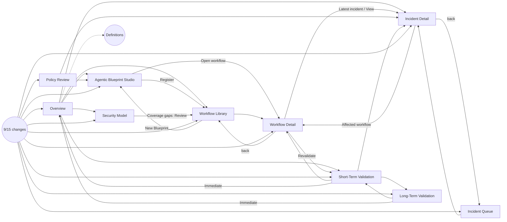

# Site map and UX path audit

> **Status: resolved.** Every issue in sections 4 and 5 was fixed on 2026-09-15. [`UX_FIXES.md`](UX_FIXES.md) gives the logic for each fix. A re-crawl of 201 interactive elements after the fixes found 0 JavaScript errors, and only the expected no-ops from section 6 left without a reaction. The audit below describes the page *before* the fixes.

**Page:** `index.html` (9/15, commit `5853872`, live at [silex-mockup.vercel.app](https://silex-mockup.vercel.app/))
**Date:** 2026-09-15

**Method:**
1. **Automated crawl.** Headless Chrome put the page into 34 UI states: every page, every Blueprint step, every incident tab, both library views, workflow detail for a deployed and a newly registered workflow, both policy views, every Security Model tab, and every modal. In each state it clicked every visible interactive element: 220 in total, including buttons, links, expandable sections, selects, inputs and anything with a pointer cursor. For each click it recorded one of: navigation, modal, toast, in-page change, or no reaction, plus any JavaScript error.
2. **Flow review** of the resulting navigation map and the page logic, to find paths that work but make no sense.

---

## 1. Summary

| Check | Result |
| --- | --- |
| JavaScript errors while clicking | **0** |
| Clicks that navigate | 81, all to existing pages |
| Clicks that open or close a modal | 14 |
| Clicks with a toast only | 12 |
| Clicks with an in-page change (tab, step, filter, expand, run) | 89 |
| Clicks with no reaction | 22, of which **9 are real problems** (section 4) and 13 are expected (section 6) |
| Paths that work but are unreasonable | **14** (section 5): 4 high, 5 medium, 5 low |

---

## 2. Site map

```text
SILEX
├── Top bar
│   ├── ⓘ Definitions ─────────────── modal: PRD terminology, "Formula TBD"
│   └── ◆ 9/15 changes ───────────── modal: change list → "Go" to each page; highlight toggle
│
├── WORKSPACE
│   └── Overview
│       ├── Enterprise Security Posture (4 metrics) → Definitions · Workflow Library · Short-Term Validation
│       ├── World Model Coverage → Security Model
│       ├── Domain Suites (5) → Security Model › Domain Suites (suite selected)
│       ├── Workflow Coverage → Workflow Library
│       ├── Policy Decisions (3 pending) → Incident Detail (I-1042, I-1038) · Agentic Blueprint Studio
│       └── More detail (collapsed): Recent material activity · Coverage confidence detail
│
├── WORKFLOW SECURITY
│   ├── Agentic Blueprint Studio
│   │   ├── 1 Build ─────── NL prompt · graph (drag, ＋Agent, ＋Control, auto layout, remove) · inspector · Save draft
│   │   ├── 2 Confirm ───── acknowledgement → Confirm Blueprint → Edit as v1.1 draft | Validate Blueprint
│   │   ├── 3 Validate ──── run steps → findings · reachability · alternative paths → Generate and test candidates
│   │   ├── 4 Optimize ──── candidates A/B/C · path ↔ control · recommendation card → Review decision
│   │   ├── 5 Decide ────── Approve (modal) | Modify (threshold → re-run) | Reject (→ Optimize)
│   │   └── 6 Register ──── Register Workflow → Workflow Library | Workflow Detail (WF-041)
│   │
│   ├── Incident Queue (cards | list, search, 7 filter buttons)
│   │   └── Incident Detail (per incident)
│   │       ├── Evidence & known path → technical detail: causal graph (5 modes)
│   │       ├── Alternative paths
│   │       ├── Candidates & recommendation
│   │       ├── Decision: Approve (modal) | Modify (scope → re-run) | Reject (→ Candidates)
│   │       └── Affected workflow → Workflow Detail
│   │
│   ├── Workflow Library (table | cards, search, domain filter, deployment filter)
│   │   └── Workflow Detail (per workflow)
│   │       ├── Latest incident → Incident Detail
│   │       ├── Revalidate → Short-Term Validation
│   │       ├── Mark as deployed (registered, not deployed only)
│   │       └── Graph · Security posture · Activity (View → Incident) · Detail (5 expandable)
│   │
│   └── Policy Review
│       ├── Workflow / incident review: 3 cards → Incident Detail › Candidates | Blueprint › Optimize
│       └── Executive queue (V1.5 preview): 4 rows → Incident Detail › Candidates | Blueprint › Optimize
│
└── ENVIRONMENT
    ├── Short-Term Validation
    │   ├── Horizon cards → Overview (Immediate) · Long-Term Validation
    │   ├── Change feed · affected workflows (3) → Workflow Detail
    │   └── Revalidate Affected Workflows → run → statuses → "Review →" Incident Detail (I-1019)
    ├── Long-Term Validation
    │   ├── Horizon cards → Overview (Immediate) · Short-Term Validation
    │   └── Run Environment Validation → six steps → result · backtest history row
    └── Security Model
        ├── Domain Suites (5 suite cards, capability tree)
        ├── World Model Coverage
        ├── Coverage Gaps → toast ("Register workflows", "Connect data") · Workflow Library ("Review")
        ├── Security Ontology (TBD)
        └── Ontology Layers (TBD)
```

### Navigation graph



---

## 3. Main flows as built

| Flow | Path | Works end to end? |
| --- | --- | --- |
| Pre-deployment (PRD §46 steps 1–9) | Blueprint Build → Confirm (ack) → Validate (run) → Optimize → Decide → Approve → Register → Workflow Detail (Registered · not deployed) | Yes |
| Deploy and monitor (§46 step 10) | Workflow Detail → Mark as deployed → Revalidate → Short-Term Validation → Revalidate Affected Workflows | Partly: the new workflow never appears among the affected workflows (5-H) |
| Post-deployment incident | Incident Queue → Incident → Evidence → Alternative paths → Candidates → Decision → Approve | Yes, but ends without a next step (5-D) |
| Modify a recommendation | Blueprint Decide or Incident Decision → Modify → change parameter → Re-run validation → updated validated state | Yes |
| Reject a recommendation | Decide / Decision → Reject → back to candidates | Yes |
| Policy review | Policy Review → Review in context → Incident Candidates / Blueprint Optimize | Incident: yes. Blueprint: skips the lifecycle (5-A) |
| Long-term (§46 step 11) | Long-Term Validation → Run Environment Validation → result | Yes |
| Coverage | Overview → World Model Coverage / Domain Suites → Security Model | Yes, with naming mismatches (5-J) |

---

## 4. Broken or dead clicks

| # | Where | Element | What happens | Severity | Fix |
| --- | --- | --- | --- | --- | --- |
| 4-1 | Incident Queue | *Domain: all*, *Workflow: all*, *Agent: all*, *Severity: all*, *Status: open*, *Type: all*, *Last 30 days* (7 buttons) | Nothing. They look like filters but have no handler; only the search box filters. | **High** | Make them dropdowns that filter cards and list, or render them as disabled chips |
| 4-2 | Blueprint › Optimize | *Recommended control* card (pointer cursor) | Nothing | Medium | Remove the pointer cursor, or make it select / expand the control |
| 4-3 | Incident › Candidates | *Recommended control* card (pointer cursor) | Nothing | Medium | Same as 4-2 |
| 4-4 | Blueprint › Build › inspector | *Role* text field | Typing changes nothing; the node keeps its name and role | Low | Update the selected node's label, or mark the field read-only |
| 4-5 | Blueprint › Build › inspector | *Permission scope* and *Credential* selects | Selection is not stored and changes nothing | Low | Store per node and show on the node, or show as read-only |

---

## 5. Paths that work but are unreasonable

| # | Path | Problem | Severity | Suggested fix |
| --- | --- | --- | --- | --- |
| 5-A | Policy Review › *Review in context* (Customer Refund) or Executive queue › *Refund Processing* → Blueprint | Opens Blueprint at **Optimize** even when the blueprint is still a Draft: never confirmed or validated. The status chip keeps saying *Draft*, and the user can then Decide, Approve and Register without the PRD §22 preconditions. | **High** | Jump to Optimize only after Confirm and Validate are done; otherwise open Confirm with a note, or run the blueprint's state forward first |
| 5-B | Overview or Workflow Library › *＋ New Blueprint* after a blueprint was registered | Lands on the completed Register step (all steps green, "Registered"). There is no way to start a new blueprint. | **High** | *New Blueprint* resets Blueprint Studio to Build with a fresh draft; keep the registered one in the library |
| 5-C | Blueprint › Decide or Incident › Decision → *Approve* more than once | Approval can be repeated. Each approval lowers the Overview *Policy Decisions* count again, even for items not in that list (e.g. I-1031). After registration, Policy Review can reopen Decide and **Reject** an already registered workflow. | **High** | After a decision, disable Approve / Modify / Reject and show the decided state; decrement the pending count once per item that is actually pending |
| 5-D | Incident › Decision → *Approve* | Ends on a success message with no next action (PRD §44 continuity). | **High** | Add next actions: *Open affected workflow*, *Revalidate workflow*, *Back to queue* |
| 5-E | Overview › Policy Decisions › *Manager approval for refunds above $500* | Opens Blueprint Studio at whatever step it is on (usually Build), not at the decision that needs review. | Medium | Open the blueprint's Decide step when it is Ready for approval; otherwise show its current state and what is left |
| 5-F | Incident Queue › *I-0994 (Closed)* | A closed, re-validated incident still shows open alternative paths, candidates and Approve / Modify / Reject. | Medium | Show closed incidents read-only with the approved control and re-validation result |
| 5-G | Workflow Detail › *Revalidate* | Always opens the same Short-Term Validation page with the same three affected workflows, even for a workflow that is not in that list (WF-014, WF-005, WF-026, WF-041). | Medium | Revalidate the current workflow in place (progress + result), or open Short-Term Validation filtered to it |
| 5-H | Workflow Detail › *Mark as deployed* → Short-Term Validation | The newly deployed workflow does not appear in the change feed or affected workflows, so the PRD's "after deployment, SILEX keeps validating it" step can't be shown with it. | Medium | Add a "New deployment: Customer Refund" change and list WF-041 as affected |
| 5-I | Overview (*24 registered*, *31 known*, *4 at risk of 24*) vs Workflow Library (*6 registered*) | The same "registered" count differs between pages. Registering adds 1 to both (25 vs 7). | Medium | Label Library counts as "shown in this demo" everywhere or align Overview to the demo set; link *Workflows at risk* to a library filtered by risk |
| 5-J | Overview Domain Suites *IT* and *Operations & HR* → Security Model | Land on suites named *Identity & IT* and *Human Resources*. | Low | Use the same suite names on both pages |
| 5-K | Short-Term / Long-Term › *Immediate Validation* card | Goes to Overview, which is not an immediate-validation page. | Low | Open the latest validation result (Blueprint Validate or the most recent incident), or make the card non-clickable with an explanation |
| 5-L | Incident Queue › List view | The list has 5 incidents; the card view has 6 (I-0994 missing). | Low | Add the I-0994 row |
| 5-M | Security Model › Coverage Gaps › *Review* (7 unregistered workflows) | Opens the full library, which has no "known but not registered" list. | Low | Add an "Unregistered" filter or section to the library |
| 5-N | Blueprint stage bar | Completed steps are not clickable; going back needs specific buttons (Back to edit, Reject). | Low | Let users click completed steps to review them (read-only after confirmation) |

---

## 6. Expected no-ops (not bugs)

| Where | Element | Why no reaction is fine |
| --- | --- | --- |
| Incident Queue, Workflow Library, Policy Review | The segment already selected (*Cards*, *Table*, *Workflow / incident review*) | Already active |
| Incident Detail | The tab already selected (*Evidence & known path*) | Already active |
| Security Model | The tab already selected (each of the 5 tabs, in its own state) | Already active |
| Short-Term / Long-Term Validation | The current horizon card | It is the current page |
| Blueprint › Build | Natural-language textarea | Takes effect when *Generate / Update* is clicked |
| Blueprint › Confirm | *Confirm Blueprint* (disabled) | Enabled only after the acknowledgement is ticked (PRD §12) |

---

## 7. Suggested fix order

1. **Lifecycle integrity** (5-A, 5-B, 5-C): guard jumps into later Blueprint steps; reset for a new blueprint; lock decisions once made.
2. **Continuity** (5-D, 5-E, 5-G, 5-H): a next action after every decision; open the right step or workflow; include newly deployed workflows in short-term revalidation.
3. **Dead controls** (4-1 to 4-3): working incident filters; remove misleading pointer cursors.
4. **Consistency** (5-F, 5-I, 5-J, 5-L, 5-M): closed incidents read-only; aligned counts and suite names; complete list view; unregistered-workflows filter.
5. **Polish** (4-4, 4-5, 5-K, 5-N).

Re-run the crawl after fixing. A clean result means 0 JavaScript errors, no "no reaction" outside section 6, and every flow in section 3 working end to end.
